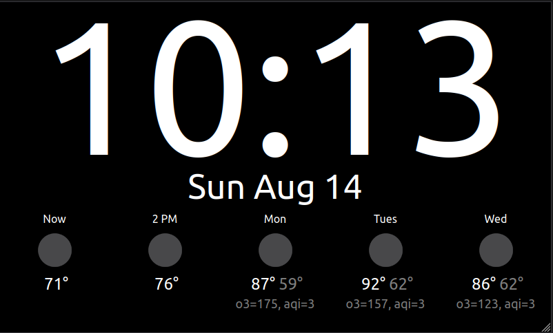

# pi-clock
Raspberry pi web based clock, built with React. \
The clock is designed for a screen at least 800x480px resolution (standard 7" pi touchscreen).

## Example clock


## Setup

Install dependencies:
```
sudo apt-get install xdotool unclutter sed docker.io
```

Before building, create the .env file with API key and location info. Reference .env-example \
Then build the docker image (from project root):
```
docker build . -f ./Dockerfile -t pi-clock
```

Create the docker container to auto start on boot:
```
docker run -d \
  -p 80:80 \
  --name=pi-clock \
  --restart=always \
  pi-clock
```

Move the file `kiosk/kiosk.sh` to `/home/pi/kiosk.sh`

Move the file `kiosk/kiosk.service` to `/lib/systemd/system/kiosk.service`

To enable the kiosk mode to start on boot:
```
sudo systemctl enable kiosk.service
```

Reboot to run the web app and open kiosk mode with a window for the clock/weather app.

For more detailed build and setup instructions: \
https://pimylifeup.com/raspberry-pi-kiosk/ \
https://mherman.org/blog/dockerizing-a-react-app/
