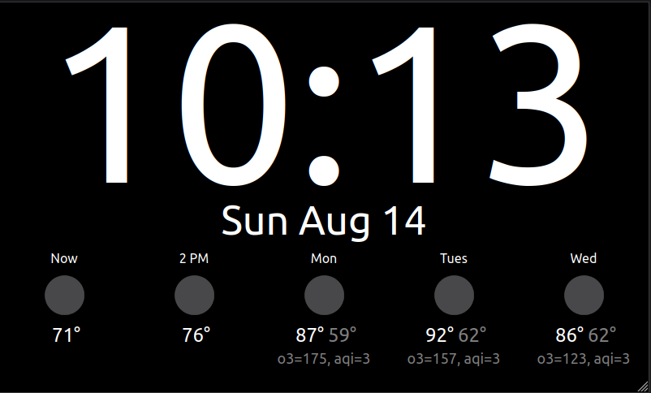

# pi-clock
Raspberry pi web based clock, built with React. \
The clock is designed for a screen at least 800x480px resolution (standard 7" pi touchscreen).

## Example clock


## Setup

Install dependencies:
```shell
sudo apt-get install xdotool unclutter sed docker.io
```

Before building, create the clock/.env file with API key. Reference clock/.env-example

Build and run from project root:
```shell
docker compose up --build -d
```
Bring down, if needed (deletes geoip cache):
```shell
docker compose down -v
```

Move the file `kiosk/kiosk.sh` to `/home/pi/kiosk.sh`

Move the file `kiosk/kiosk.service` to `/lib/systemd/system/kiosk.service`

To enable the kiosk mode to start on boot:
```shell
sudo systemctl enable kiosk.service
```

Reboot to run the web app and open kiosk mode with a window for the clock/weather app.

For more detailed build and setup instructions: \
https://pimylifeup.com/raspberry-pi-kiosk/ \
https://mherman.org/blog/dockerizing-a-react-app/

Run in dev mode with hot reloading:
```shell
docker run -it --rm \
  -v $(pwd):/app \
  -w /app \
  node:16 \
  bash -c "npm install"

docker run -it --rm \
  -p 3000:3000 \
  -v $(pwd):/app \
  -w /app \
  node:16 \
  bash -c "npm start"
```
